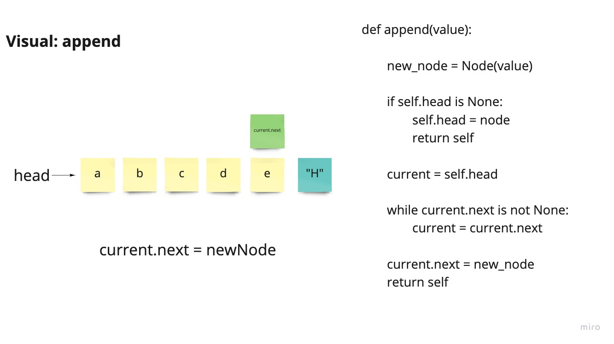
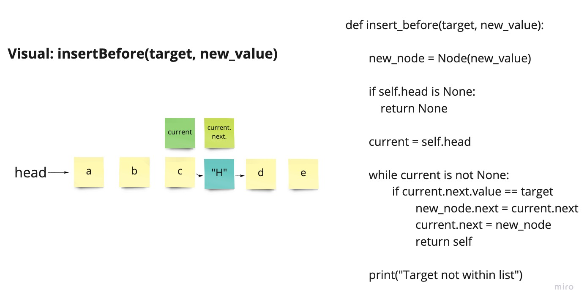
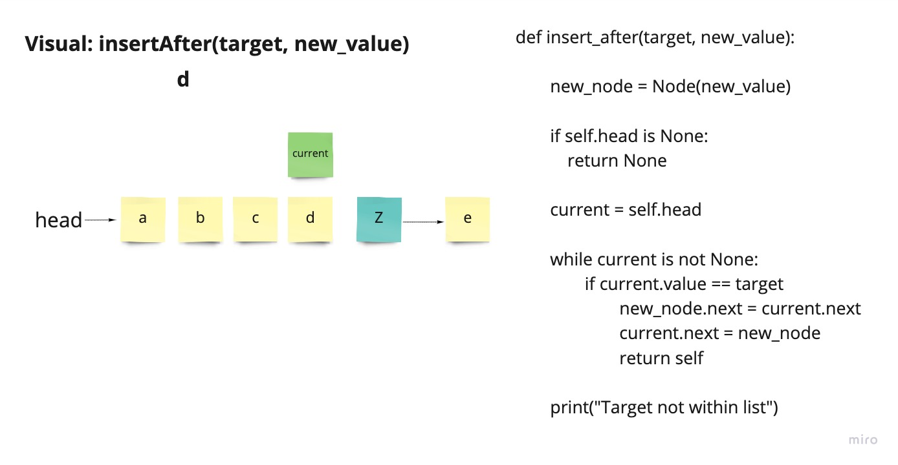

# Singly Linked List

-   A Linked List is a sequence of `Nodes` connected/linked to each other

-   The most defining feature of a Linked List is that each `Node` references the next `Node` in the link

## Code Challenge 05

### Features

-   [x] Create a Node class that has properties for the value stored in the Node, and a pointer to the next Node.

-   [x] Within your LinkedList class, include a head property. Upon instantiation, an empty Linked List should be created.

-   [x] Define a method called `insert` which takes any value as an argument and adds a new node with that value to the `head` of the list with an O(1) Time performance.

-   [x] Define a method called `includes` which takes any value as an argument and returns a boolean result depending on whether that value exists as a Node’s value somewhere within the list.

_UPDATE_

-   [x] Define a method called `toString` (or `__str__` in Python) which takes in no arguments and returns a string representing all the values in the Linked List, formatted as:

    -   `"{ a } -> { b } -> { c } -> NULL"`

-   As instructed, tests were written to prove the above functionality

## Code Challenge 06

### White Board

### Features

-   [x] `.append(value)` which adds a new node with the given `value` to the end of the list

-   [x] `.insertBefore(value, newVal)` which add a new node with the given `newValue` immediately before the first `value` node

-   [x] `.insertAfter(value, newVal)` which add a new node with the given `newValue` immediately after the first `value` node

-   As instructed, tests were written to prove the above functionality

### Documentation

For Lab 06 I group coded with Anthony Williams and Davee Sok. Davee also helped me to define my `__str__` method
